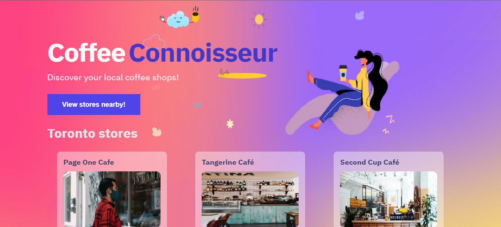

# Full Stack find a café

## About

Café finder website that uses geotracking to find nearby café using api. And store watched café in a database.  
Built with Next.js  
Background done with [MeshGradient](https://meshgradient.com/)  
Uses following APIs

Images from [UnSplash](https://unsplash.com/)  
Café from [Foursquare](https://foursquare.com)
Database with [Airtable](https://airtable.com/invite/r/CIPXjCrJ)
